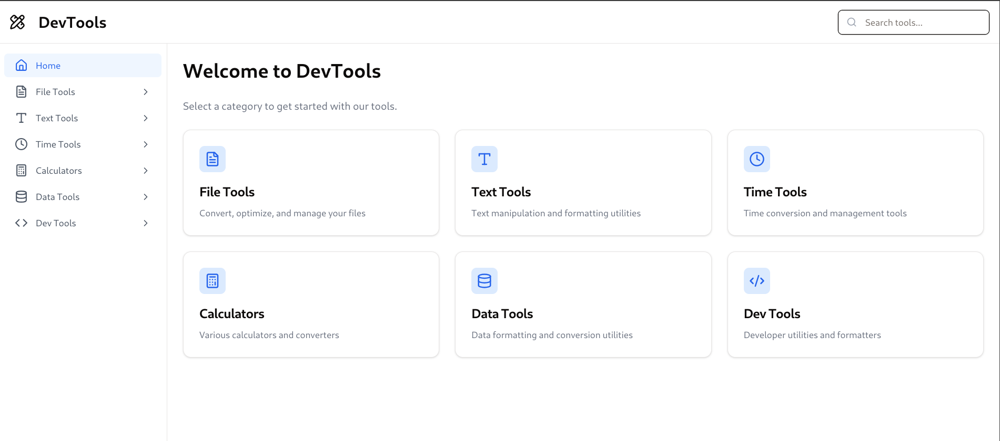

# DevTools - Web Utility Suite



DevTools is a comprehensive web application that provides a collection of commonly needed utilities and tools for everyday use. Built with React and styled with Tailwind CSS, it offers a clean, intuitive interface for various calculations, conversions, and data manipulations.

## 🌟 Features

### File & Media Tools
- File format conversions
- Image optimization
- PDF tools
- File size reducer

### Text Tools
- Case converter
- Grammar checker
- Word counter
- Lorem ipsum generator

### Time Tools
- Timezone converter
- Meeting planner
- Countdown timer
- Pomodoro timer
- Date calculator

### Calculators
- Currency converter
- Scientific calculator
- Percentage calculator
- Loan calculator
- Unit converter

### Data Tools
- JSON formatter
- CSV JSON converter
- Password generator
- QR code generator

### Developer Tools
- Code formatter
- Regex tester
- Base64 converter
- Markdown previewer
- SQL to CAML converter
- Hash generator
- HTML to Markdown converter
- Markdown to HTML converter
- XML to JSON converter
- JSON to XML converter

## 🚀 Getting Started

### Prerequisites
- Node.js (v16.0.0 or higher)
- npm (v7.0.0 or higher)

### Installation

1. Clone the repository
```bash
git clone https://github.com/Anky9972/dev-tools.git
cd devtools
```

2. Install dependencies
```bash
npm install
```

3. Start the development server
```bash
npm run dev
```

4. Build for production
```bash
npm run build
```

## 💻 Tech Stack

- **Frontend Framework:** Next.js
- **Styling:** Tailwind CSS
- **Icons:** Lucide React
- **UI Library:** Shadcn UI


## 📱 Responsive Design

The application is fully responsive and works on:
- Desktop (1024px and above)
- Tablet (768px to 1023px)
- Mobile (below 768px)

## 🔍 Testing

Run tests using:
```bash
npm test
```

## 🚀 Deployment

1. Build the project:
```bash
npm run build
```

2. Deploy the `dist` folder to your hosting service


## 🙏 Acknowledgments

- [React](https://reactjs.org/)
- [Tailwind CSS](https://tailwindcss.com/)
- [Lucide Icons](https://lucide.dev/)
- [Vite](https://vitejs.dev/)
- [Shadcn UI](https://ui.shadcn.com/)


Project Link: [https://github.com/Anky9972/dev-tools](https://github.com/Anky9972/devtools)

Live Demo: [https://developerstool.netlify.app/](https://developerstool.netlify.app/)
---

Made with ❤️ by [Vivek Gaur]